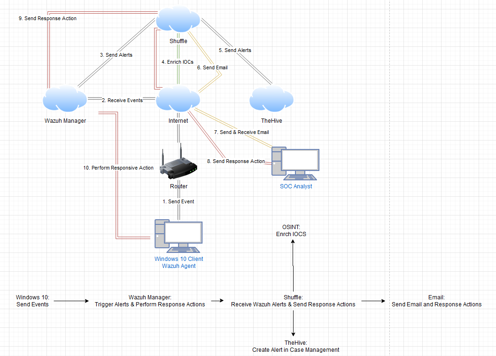
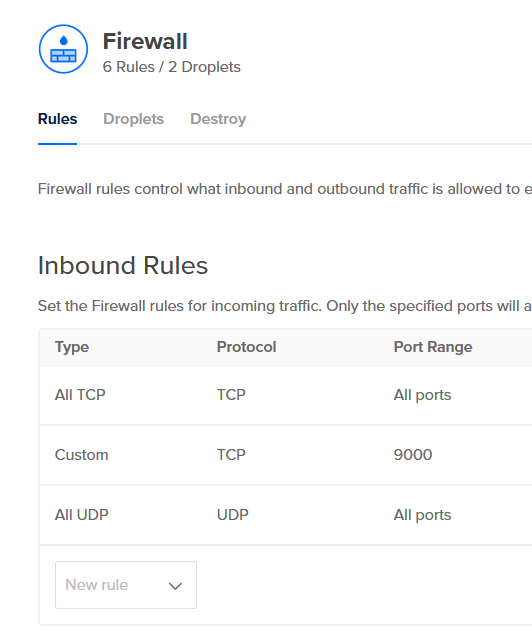
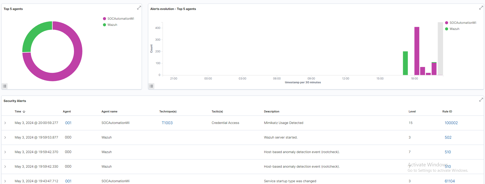
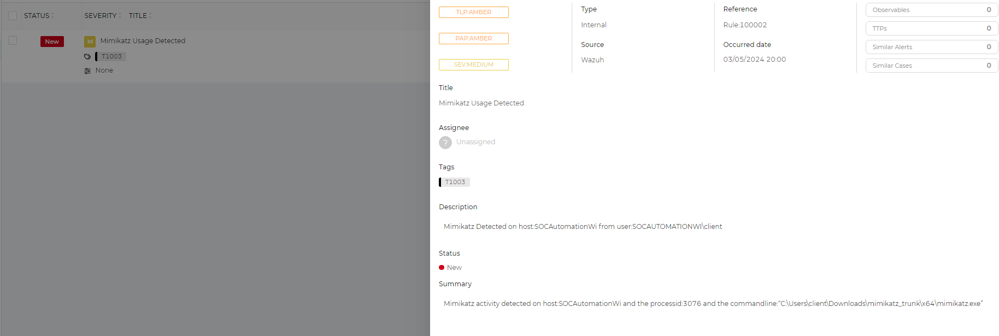
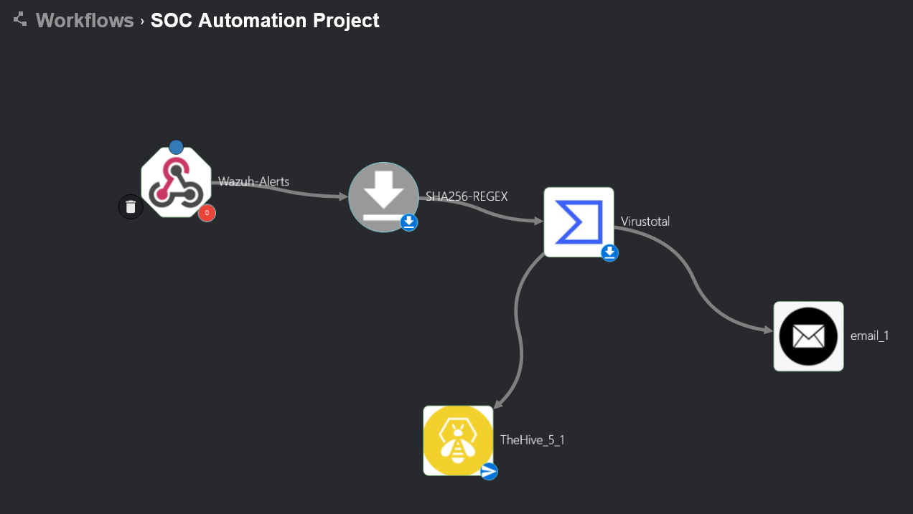

# Building a Security Operations Center (SOC) Lab: A Step-by-Step Guide

In today's cybersecurity landscape, the ability to detect and respond to security incidents is crucial. A Security Operations Center (SOC) serves as the nerve center for monitoring, detecting, analyzing, and responding to cybersecurity incidents. In this lab, we'll simulate a SOC scenario to detect an incident on a Windows 10 client, report it, and notify an analyst. We'll utilize a range of tools including Wazuh, TheHive, Shuffle, and more to orchestrate our SOC workflow effectively.

## Understanding Key Components

In this lab, we utilize a variety of tools and technologies to simulate a Security Operations Center (SOC) environment. Let's delve into the core components of our setup:

### Wazuh

**Wazuh** is an open-source security monitoring platform designed for threat detection, incident response, and compliance management. It functions as a host-based intrusion detection system (HIDS), analyzing system logs, file integrity, and network traffic to identify potential security threats. Wazuh provides real-time visibility into security events and offers extensive customization options for rule-based detection and response.

### TheHive

**TheHive** is an open-source security incident response platform that facilitates collaboration and coordination among security teams. It serves as a centralized repository for managing security incidents, analyzing threat data, and generating comprehensive reports. TheHive integrates with various security tools and platforms, enabling seamless workflow orchestration and automated incident response actions.

### Mimikatz

**Mimikatz** is a powerful post-exploitation tool commonly used by red teams and attackers to extract credentials and perform lateral movement within compromised environments. It can manipulate Windows authentication protocols, retrieve passwords from memory, and escalate privileges on compromised systems. In our lab, we use Mimikatz to simulate a security threat and test the effectiveness of our detection and response mechanisms.

### Sysmon

**Sysmon** is a Windows system service and device driver that monitors and logs system activity at a granular level. It provides detailed information about process creation, network connections, file modifications, and registry changes, enabling enhanced visibility into system behavior. Sysmon is often deployed in security monitoring environments to detect and investigate suspicious activities and potential security incidents.

### Shuffle

**Shuffle** is a security orchestration, automation, and response (SOAR) platform that streamlines incident response workflows and automates repetitive tasks. It integrates with various security tools and systems to aggregate security alerts, prioritize incidents, and orchestrate response actions. Shuffle enables security teams to enhance their operational efficiency, reduce response times, and improve overall security posture.

### VirusTotal

**VirusTotal** is a web-based service that aggregates and analyzes suspicious files and URLs to detect malware and malicious activities. It utilizes a vast database of antivirus engines and threat intelligence feeds to perform comprehensive malware analysis and provide insights into potential security risks. VirusTotal's API allows integration with security tools and platforms, enabling automated threat intelligence gathering and malware detection capabilities.

By leveraging these tools collectively, we create a robust SOC environment capable of detecting, analyzing, and responding to security incidents effectively. Each component plays a crucial role in enhancing our security posture and strengthening our defenses against evolving cyber threats.

## Step 1: Creating a Project Diagram

Before diving into the setup, it's essential to visualize our lab environment. Using tools like Draw.io, we create a diagram outlining the components involved:
- Windows 10 client
- Wazuh Server
- TheHive Server
- Shuffle
- And more, depending on the complexity of your setup.

Documenting your project architecture is vital for understanding and communicating the setup effectively.

## Step 2: Setting Up the Windows 10 Client

We begin by setting up a Windows 10 virtual machine in VirtualBox, which will act as our client throughout the lab. Additionally, we install Sysmon on this VM to enhance visibility into system activity.

## Step 3: Deploying the Wazuh Server

Utilizing a cloud platform like DigitalOcean, we deploy a Droplet running Ubuntu to serve as our Wazuh server. We configure firewall rules to restrict inbound traffic and ensure security. SSH access is established to the server for further setup.

## Step 4: Installing Wazuh

Once connected to the Wazuh server, we install Wazuh using a curl command from their official site. After installation, we access the Wazuh web interface using the provided credentials and the Droplet's IP address.

## Step 5: Setting Up TheHive Server

Similar to the Wazuh server, we deploy a server for TheHive. We install and configure Java, Cassandra, TheHive, and Elasticsearch on this server. Accessing TheHive's web interface allows us to manage security incidents effectively.

## Step 6: Troubleshooting and Optimization

During setup, we encounter issues with Elasticsearch crashing. To resolve this, we configure Elasticsearch to limit memory usage, ensuring stability.

## Step 7: Adding Agents to Wazuh

Agents are added to Wazuh for endpoint monitoring. Using PowerShell commands provided by Wazuh, we install the agent on our Windows client VM.

## Step 8: Configuring Log Analysis for Sysmon

We configure the ossec.conf file on the Windows client to enable log analysis for Sysmon, enhancing our detection capabilities.

## Step 9: Integrating Mimikatz

We download and configure Mimikatz, a tool commonly used by red teams. Configurations are adjusted in Wazuh to ensure comprehensive logging of Mimikatz activity.

## Step 10: Creating Rules and Alerts

New rules are added to Wazuh to detect Mimikatz usage. Alerts are triggered, providing visibility into potential security threats.

## Step 11: Implementing Shuffle for Orchestration

Shuffle is introduced to orchestrate our SOC workflow. It forwards alerts to TheHive and notifies analysts via email for further analysis.

## Step 12: Enhancing Detection with VirusTotal

We integrate VirusTotal into our workflow to perform hash lookups, enriching our incident response capabilities.

## Step 13: Collaborating with TheHive

Users and organizations are set up in TheHive to facilitate collaboration and incident management. TheHive is integrated into Shuffle to streamline the reporting process.

## Step 14: Finalizing Workflow

Our workflow is finalized, ensuring that alerts from Shuffle are reported in TheHive, and analysts are promptly notified via email.

By following these steps, we've successfully created a simulated SOC environment capable of detecting and responding to security incidents effectively. This hands-on lab provides valuable experience in cybersecurity incident response and the utilization of SOC tools and workflows.

Lab idea from [MyDFIR on YouTube]
